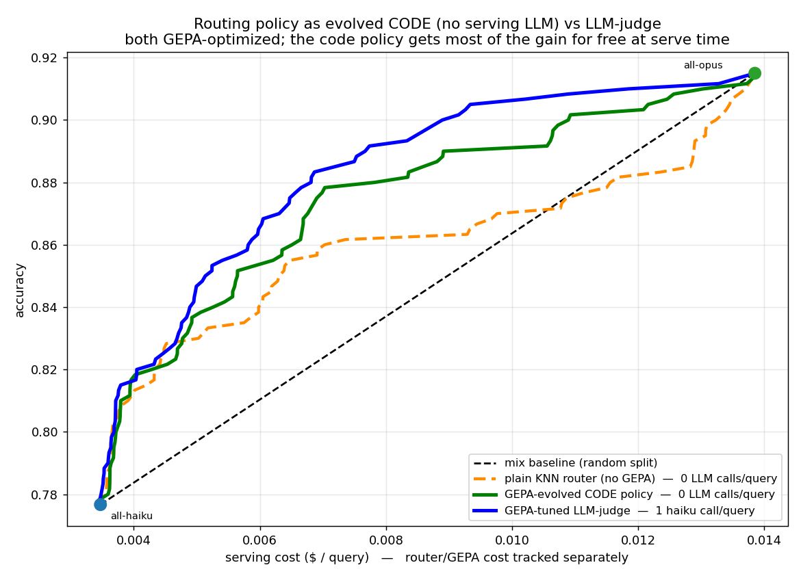

# training-free-llm-router

A **memory-based, training-free** cost-aware LLM router. Unlike the sibling
project [`llmrouter`](https://github.com/lotusroot-kim/llm-router) — which
*fine-tunes* a backbone to predict routing + cost — this one **trains nothing**.
It keeps a memory of past `(query, model)` outcomes, retrieves the most similar
past problems at route time, and lets a cheap model (**haiku**) read those
outcomes to decide whether **haiku** or **opus** should answer — then sharpens
that decision with **GEPA prompt evolution**.

The whole thing is a study in *closing the gap to oracle without any gradient
step* — every gain comes from retrieval, prompting, and threshold calibration.

# TRAINING (offline, one-time)

"Training" here is **gradient-free**: we build a memory, then let GEPA evolve a
text prompt. No weights are ever updated.

## Step 1 — Build the memory

```
routing_train.jsonl  (2,400 past queries; each query already has, for haiku & opus,
                       its recorded  performance / cost / output_tokens)
        │
        ├─ Qwen3-Embedding-0.6B  ─▶  query embedding (1024-d, cosine-normalized)
        └─ recorded outcomes      ─▶  per-model labels (perf, cost, tokens)
        ▼
MEMORY  =  for each past query: { embedding , haiku/opus perf·cost·tokens }
```

The memory is just a lookup table of *what happened before*. No model is trained on it.

## Step 2 — GEPA: evolve the routing score-prompt

The router's one decision is made by a **score-prompt** that tells haiku how to
read the retrieved neighbors and output, per model, `P(correct)` and predicted
output tokens. GEPA (Genetic-Pareto reflective prompt evolution) rewrites that
prompt — the prompt text is the *only* thing that "learns".

```
seed score-prompt
     │
     ▼   ┌────────────────── one GEPA round (repeat N) ──────────────────┐
     │   │ 1. ROLLOUT  — sample a dev minibatch from MEMORY (leave-self-  │
     │   │    out kNN, so a query never retrieves itself). Run the router │
     │   │    with the current prompt; build the honest cost/accuracy     │
     │   │    curve and score it (area above the haiku↔opus mix line).    │
     │   │ 2. REFLECT  — show OPUS the prompt + its worst per-model        │
     │   │    estimation errors; OPUS writes an IMPROVED prompt            │
     │   │    (reflective mutation — natural-language "gradient").         │
     │   │ 3. SELECT   — keep a Pareto pool of prompts (each best on some  │
     │   │    slice), sample a parent by how many slices it wins           │
     │   │    (pareto-frequency), occasionally MERGE two strong prompts,   │
     │   │    thread ancestor LINEAGE so edits don't repeat, and RESAMPLE  │
     │   │    a fresh minibatch each round to avoid overfitting one batch. │
     │   └────────────────────────────────────────────────────────────────┘
     ▼
evolved SCORE-PROMPT   →  gepa_score_qwen_instruction.txt
```

- **Objective**: maximize the routed cost/accuracy curve's area above the mix
  line — i.e. better *cost-aware* routing, not raw accuracy.
- **Reflection model** = opus; **rollout model** = haiku. Both spends go in the
  one-time *optimization* ledger, never into serving cost.
- **No gradients, no test set.** GEPA only sees the memory dev split; the 600
  test queries are held out for the final curve.
- **Co-tuning matters**: the prompt is evolved *on the Qwen-retriever's neighbor
  distribution* — swapping the retriever without re-running GEPA underperforms.

# INFERENCE (online, per query)

Exactly **one embedding + one haiku call** per query — nothing else.

```
new query
   │  Qwen3-Embedding-0.6B  (same encoder as the memory)
   ▼
cosine kNN over MEMORY  ─▶  top-k similar past problems
   │                        (their haiku/opus correctness, cost, tokens)
   ▼  ONE haiku call, guided by the GEPA-evolved score-prompt
estimate, per model:  P(correct)  +  predicted output tokens
   │
   ▼  router predicts cost itself from the token estimate (no peeking at truth):
   │     signal = ( p_opus − p_haiku ) / predicted_Δcost
   ▼  route by a cost threshold τ  (τ sets the cost/accuracy operating point)
answer with  HAIKU (cheap)  or  OPUS (strong)
```

The router **predicts cost itself**, so the cost-aware signal is *honest* — it
never reads the answer model's true cost at route time. The threshold τ slides
the operating point along the cost/accuracy curve below.

## Two cost ledgers (kept strictly separate)

| ledger | what it is |
|---|---|
| **serving $** | what the *chosen* answer model would cost (from recorded data) |
| **router $** | the router's own spend: embedding + the one haiku call (~$0.0008/query) |
| **optimization $** | one-time GEPA spend (haiku dev rollouts + opus reflections) |

Serving cost is the only thing plotted on the x-axis. Router and optimization
costs are reported separately and never folded in. **Serving is always one
embedding + one haiku call per query.**

## The result: ~opus accuracy at roughly half the cost

On the **held-out 600-query test set**, with the *honest* cost-aware signal
(router-predicted Δcost):

| operating point | accuracy | cost / query |
|---|---|---|
| all-haiku | 0.777 | $0.0035 |
| all-opus | 0.915 | $0.0139 |
| **router @ ~half opus cost** | **0.883** (96.5% of opus) | **$0.0069** |
| router holding 97% of opus accuracy | 0.888 | $0.0075 (**54% of opus**) |

So the router **keeps ~97% of opus's accuracy at roughly half the cost.** The
headline optimization metric is **mean accuracy above the haiku↔opus mix line**
(the curve you'd get by randomly sending X% of queries to opus); the
GEPA-optimized router reaches **+0.0366** above that line (oracle ceiling
+0.0502), a **2.1×** lift over the hand-written seed prompt and a **58%** smaller
gap to oracle. At a $0.007/query budget it even edges past the cheapest-correct
oracle, because cost-aware ordering beats "always cheapest-correct" in the
thrifty regime.


## RouterGEPA: evolving the routing policy as CODE (0 LLM calls at serving)

The router above asks **haiku** (one LLM call/query) to read the retrieved
neighbors and score each model. Can we drop that serving-time LLM entirely?

**RouterGEPA** replaces the LLM judge with a small **Python function**

```python
route(neighbors) -> (p_haiku, p_opus, out_haiku, out_opus)
```

that maps the kNN neighbor statistics to each model's P(correct) and token
estimate. The **seed** is a plain similarity-weighted average — i.e. a vanilla
kNN router. GEPA then evolves the *source code* of that function: opus reads the
current function plus its worst routing decisions and rewrites it (reflective
evolution of an **algorithm**, not a prompt). No gradients, no LLM at route time —
serving cost is just kNN retrieval + numpy.

What GEPA's evolved code added over the plain-kNN seed (it discovered these on its
own): similarity-**sharp exponential weighting**, an **effective neighbor count**
with **shrinkage toward a prior** on low support, an **opus-dominance floor**, and
a **robust (median-blended) token estimate**.

On the held-out 600-query test, mean accuracy **above the haiku↔opus mix line**:

| router | serving cost | above mix-line |
|---|---|---|
| plain KNN router (no GEPA) | 0 LLM calls | +0.0142 |
| **RouterGEPA — evolved CODE policy** | **0 LLM calls** | **+0.0291** |
| GEPA-tuned LLM-judge | 1 haiku call | +0.0373 |

GEPA roughly **doubles** the plain-kNN router (**2.05×**) with **zero serving LLM
calls**, capturing **~78%** of the LLM-judge's gain for free at serve time.



```bash
# evolve the routing policy as code (GEPA/opus runs once, offline)
$PY gepa_code.py --memory memory_qwen.jsonl --out gepa_code_policy.py --dev 200 --iters 8

# score plain-KNN seed and the evolved policy on held-out test, then plot
$PY run_code_policy_test.py --policy seed_code_policy.py  --out threshold_scores_code_seed.jsonl
$PY run_code_policy_test.py --policy gepa_code_policy.py  --out threshold_scores_code.jsonl
$PY plot_code_vs_llm.py                                   # -> curve_code_vs_llm.png
```

## What moved the needle (and the dead ends)

This repo keeps the failures because they're the interesting part:

1. **Binary routing can't beat the mix line.** A HAIKU/OPUS decision gives one
   operating point; you need a *continuous* score to order queries by benefit.
   → threshold routing on the marginal `p_opus − p_haiku`.
2. **"Cost-aware" was cheating at first.** Dividing the signal by the *recorded*
   Δcost leaked future info (real output length ≈ difficulty). Fix: the router
   **estimates output tokens itself** and divides by *predicted* Δcost — honest.
3. **GEPA prompt optimization is the main lever.** Evolving the score prompt
   (reflective mutation + Pareto-frequency selection + system-aware merge +
   ancestor lineage + minibatch resampling) lifted the curve **2.1×** over the
   seed prompt — with zero training, just a better text prompt.
4. **Self-ensemble backfired.** Averaging several estimation "lenses" in one call
   *reduced* the marginal-signal spread — here the extremes were signal, not
   noise. Reverted.
5. **Retriever and prompt must be co-optimized.** A stronger embedding helps only
   when the score prompt is **re-tuned on its neighbor distribution**; swapping
   the retriever alone underperformed until GEPA was re-run on top of it.

## Files

| file | purpose |
|---|---|
| `common.py` | Bedrock helpers (embed, haiku decide, opus reflect) + cost rates |
| `build_memory.py` | build the memory from `routing_train.jsonl` + embeddings |
| `router.py` | `MemoryRouter`: kNN retrieval, `score()` (P(correct)+tokens), separate router-cost ledger |
| `eval_threshold.py` | score the test set once, sweep a threshold → continuous cost/accuracy curve |
| `gepa_score.py` | GEPA for the score prompt (objective = area above the mix line) |
| `gepa_score_v2.py` | GEPA + pareto-frequency sampling, system-aware merge, lineage, minibatch resample |
| `qwen_embed.py` | embed memory + test with Qwen3-Embedding-0.6B on a GPU host |
| `plot_gepa_score.py` | cost/accuracy curve |

## Reproduce

```bash
PY=python3        # needs boto3 + numpy + matplotlib; Bedrock access in us-west-2

# 1. embed memory + test with Qwen3-Embedding-0.6B (on a GPU host), copy back
#    mem_qwen.jsonl / test_qwen.jsonl, and build memory_qwen.jsonl
$PY qwen_embed.py mem_queries.jsonl mem_qwen.jsonl     # on the GPU box

# 2. evolve the score prompt with GEPA on the Qwen neighbor distribution
$PY gepa_score_v2.py --memory memory_qwen.jsonl --out gepa_score_qwen_instruction.txt \
       --dev 150 --pool 400 --iters 8 --merge_every 3

# 3. evaluate the cost/accuracy curve on held-out test
$PY eval_threshold.py --memory memory_qwen.jsonl --test_qvecs test_qwen.jsonl \
       --qvec_field emb_query --score_instruction gepa_score_qwen_instruction.txt \
       --out threshold_scores_qwen_gepa.jsonl

# 4. plot
$PY plot_gepa_score.py                  # -> gepa_score_curve.png
```

Requires AWS Bedrock access to `claude-haiku-4-5` (router) and `claude-opus-4-8`
(GEPA reflection) in `us-west-2`. The Qwen retriever runs locally on any GPU. The
opus answer model is never called at route time — its outcomes come from recorded
data.
