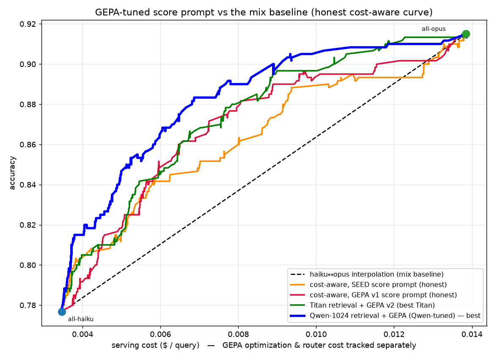

# training-free-llm-router

A **memory-based, training-free** cost-aware LLM router. Unlike the sibling
project [`llmrouter`](https://github.com/lotusroot-kim/llm-router) — which
*fine-tunes* a Qwen backbone to predict routing + cost — this one **trains
nothing**. It keeps a memory of past `(query, model)` outcomes, retrieves the
most similar past problems at route time, and lets a cheap model (**haiku**)
read those outcomes to decide whether **haiku** or **opus** should answer — then
sharpens that decision with **GEPA prompt evolution** and a **better retriever**.

The whole thing is a study in *closing the gap to oracle without any gradient
step* — every gain comes from retrieval, prompting, and threshold calibration.

## How it works

```
query ─▶ embed (Titan-256 or Qwen3-Embedding-0.6B) ─▶ cosine kNN over MEMORY (2,400 past problems)
                                                            │
                                                            ▼
                       top-k neighbors' outcomes (haiku/opus correct? cost? tokens?)
                                                            │
                                                            ▼
        ONE haiku call estimates, for each model:  P(correct)  and  predicted output tokens
                                                            │
                                                            ▼
          signal = (p_opus − p_haiku) / predicted_Δcost   →   threshold sweep = cost/accuracy curve
```

- **Memory** = `llmrouter/routing_train.jsonl`, collapsed to one record per query
  holding *both* models' recorded `performance / cost / output_tokens`, plus an
  embedding. Built by `build_memory.py`.
- **Router** = retrieval + a single **haiku** call. Crucially, the router
  **predicts cost itself** (it estimates each model's output tokens), so the
  cost-aware signal is *honest* — it never peeks at the answer model's recorded
  cost at route time.
- **No training, no fine-tuning, no gradient step anywhere.** The only "learning"
  is GEPA editing a text prompt.

## Two cost ledgers (kept strictly separate)

| ledger | what it is |
|---|---|
| **serving $** | what the *chosen* answer model would cost (from recorded data) |
| **router $** | the router's own spend: embedding + the one haiku call (~$0.0005/query) |
| **optimization $** | one-time GEPA spend (haiku dev rollouts + opus reflections) |

Serving cost is the only thing plotted on the x-axis. Router and optimization
costs are reported separately and never folded in. **Serving calls are always
one embedding + one haiku call per query — every method below keeps this fixed;
they only change the prompt text or the embedding.**

## The result: closing the gap to oracle

All numbers are on the **held-out 600-query test set**, with the *honest*
cost-aware signal (router-predicted Δcost). The headline metric is **mean
accuracy above the haiku↔opus interpolation line** (the "mix baseline" you'd get
by randomly sending X% of queries to opus). Above 0 means the router beats
random mixing at matched cost; oracle (cheapest correct model) is the ceiling.

| stage | above mix-line | gap to oracle | what changed |
|---|---|---|---|
| binary GEPA (λ-swept) | ≈ 0.000 | — | binary HAIKU/OPUS decision sits *on* the line |
| threshold + **leaky** cost | +0.046 | — | ❌ cheated: divided by *recorded* Δcost |
| threshold + honest predicted cost (seed prompt) | +0.0175 | 0.033 | router predicts its own cost |
| + GEPA v1 (reflection + Pareto) | +0.0233 | 0.027 | evolve the score prompt |
| + GEPA v2 (4 techniques) | +0.0279 | 0.022 | pareto-sample, merge, lineage, resample |
| v3 self-ensemble | +0.0107 | — | ❌ averaging blurred the signal — reverted |
| Qwen retrieval + *Titan-tuned* prompt | +0.0209 | — | ❌ retriever/prompt mismatch |
| **Qwen retrieval + Qwen-tuned GEPA** | **+0.0366** | **0.014** | ✅ co-optimize retriever + prompt |
| oracle (ceiling) | +0.0502 | 0 | — |

**Bottom line:** above-line lift went **+0.0175 → +0.0366 (2.1×)** and the
oracle gap shrank **0.033 → 0.014 (−58%)** — all training-free. At a $0.007/query
budget the final router hits **0.883 accuracy**, *above* oracle's 0.866 there
(cost-aware ordering beats "always cheapest-correct" in the thrifty regime).



## What each step taught us (including the dead ends)

This repo keeps the failures because they're the interesting part:

1. **Binary routing can't beat the mix line.** A HAIKU/OPUS decision gives one
   operating point; you need a *continuous* score to order queries by benefit.
   → switched to threshold routing on `p_opus − p_haiku`.
2. **"Cost-aware" was cheating at first.** Dividing the signal by the *recorded*
   Δcost leaked future info (real output length ≈ difficulty). Fix: the router
   **estimates output tokens itself** and divides by *predicted* Δcost. Honest
   lift is smaller but real (+0.018).
3. **GEPA helps, with diminishing returns.** v1→v2 added the paper's missing
   techniques (Pareto-*frequency* sampling, system-aware **merge**, ancestor
   **lineage**, minibatch **resampling**) for +0.0046 more. Worth it, but plateauing.
4. **Self-ensemble (v3) backfired.** Averaging 3 estimation "lenses" in one call
   *reduced* the marginal-signal spread (0.091→0.082) — here the extremes were
   signal, not noise. Reverted.
5. **A better retriever isn't plug-and-play.** Qwen3-Embedding-0.6B (1024-d, on
   GPU) improved retrieval AUC (needs-opus 0.66→0.71) but *lowered* routing with
   the Titan-tuned prompt — "good retrieval" for ranking ≠ for cost-aware
   routing. **Co-optimizing**: re-running GEPA on the Qwen neighbor distribution
   unlocked it (+0.0366). Components that depend on each other must be tuned together.

## Files

| file | purpose |
|---|---|
| `common.py` | Bedrock helpers (Titan embed, haiku decide, opus reflect) + cost rates |
| `build_memory.py` | build `memory.jsonl` from `routing_train.jsonl` + Titan embeddings |
| `router.py` | `MemoryRouter`: kNN retrieval, `score()` (P(correct)+tokens), separate router-cost ledger |
| `eval_threshold.py` | score the test set once, sweep a threshold → continuous cost/accuracy curve |
| `eval_router.py` | binary-decision router eval (earlier baseline) |
| `gepa_optimize.py` | GEPA for the **binary** decision prompt (cost-aware reward) |
| `gepa_score.py` | GEPA v1 for the **score** prompt (objective = above-line area) |
| `gepa_score_v2.py` | GEPA v2: + pareto-frequency sampling, system-aware merge, lineage, minibatch resample |
| `gepa_pareto.py` | λ sweep tracing GEPA's cost/accuracy Pareto frontier |
| `eval_retrieval.py` | Titan-256 vs Qwen-1024 retrieval-quality comparison (AUC) |
| `qwen_embed.py` | embed memory+test with Qwen3-Embedding-0.6B on GPU (run on a GPU host) |
| `plot_*.py` | result plots |

## Reproduce

```bash
PY=python3        # needs boto3 + numpy + matplotlib; Bedrock access in us-west-2

# 1. build memory (Titan embeddings, ~$0.004 one-time)
$PY build_memory.py                     # -> memory.jsonl

# 2. threshold routing eval (continuous cost/accuracy curve), seed prompt
$PY eval_threshold.py --k 8             # -> threshold_scores.jsonl, threshold_curve.png

# 3. evolve the score prompt with GEPA v2 (~$9 one-time, separate ledger)
$PY gepa_score_v2.py --dev 150 --pool 400 --iters 8 --merge_every 3
$PY eval_threshold.py --score_instruction gepa_score_v2_instruction.txt \
       --out threshold_scores_gepa_v2.jsonl

# 4. (GPU) swap in Qwen3-Embedding-0.6B retrieval, then re-tune GEPA on it
#    qwen_embed.py runs on a GPU box; copy mem_qwen.jsonl / test_qwen.jsonl back.
$PY gepa_score_v2.py --memory memory_qwen.jsonl --out gepa_score_qwen_instruction.txt ...
$PY eval_threshold.py --memory memory_qwen.jsonl --test_qvecs test_qwen.jsonl \
       --qvec_field emb_query --score_instruction gepa_score_qwen_instruction.txt \
       --out threshold_scores_qwen_gepa.jsonl

# 5. plot all curves
$PY plot_gepa_score.py                  # -> gepa_score_curve.png
```

Requires AWS Bedrock access to `amazon.titan-embed-text-v2:0`,
`claude-haiku-4-5`, and (for GEPA reflection) `claude-opus-4-8` in `us-west-2`.
The Qwen retriever runs locally on any GPU. The opus answer model is never
called — its outcomes come from recorded data.
